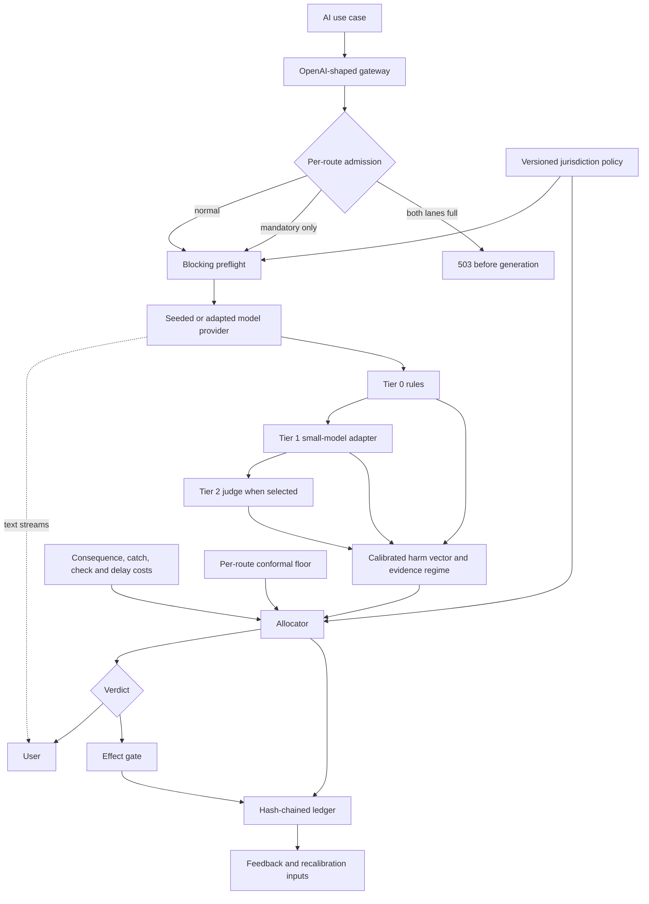

# ControlPlane

ControlPlane is an OpenAI-shaped gateway that treats responsible-AI verification as a constrained allocation problem. It combines an untradeable per-route risk floor with priced verification, a budget shadow price, effect gating, and a hash-chained decision and review ledger. The default build runs offline against a seeded provider and lexical detector stubs, so the committed evidence tests the decision system—not production model quality.

## Three findings

### Attention is the real assurance cost

Across the evaluated allocation budgets, queue attention accounts for **85.2–96.8%** of operating assurance cost. This is `attention_spend_inr / (attention_spend_inr + assurance_spend_inr)` from the committed metrics; the separate audit slice is measurement apparatus and is not charged to the operating headline. A completed review costs **INR 120**, while a full automated check costs **INR 3.20 per interaction**.

At the tightest budget, the shipped queue served **1.57x** the expected loss served by FIFO from the same **166** completed reviews. It breached **49 vs 148** SLAs and shed **1 vs 22** top-decile cases. The harder fact is capacity: keeping up with arrivals needs **5.4 reviewers**, while the scenario staffs **2**.

Evidence: [cost and review metrics](docs/results/results.json), [queue comparison](docs/results/attention.json), and [queue provenance](docs/results/attention.md).

### Authorisation beats recognition

The previous shape-only PII detector reached **0.5881 AUC**, almost exactly its **0.5869** perfect-shape ceiling. The held-out corpus explains why: **309** rows contain a real identifier in a permitted disclosure, while **57** actual leaks contain no recognisable pattern.

The authorisation-aware detector reaches **0.9879 AUC**, with **1.000 precision** and **0.766 recall**. Microsoft Presidio reaches **0.5825 AUC** here: it flags **1,044 of 1,500** rows but has **0.0747 precision**. Recognition is not the binding constraint when the decision is whether this requester may disclose this value in this route and context.

The ablations are not hidden. Removing secrets scanning drops AUC to **0.7765**, removing the fitted personal-context vocabulary drops it to **0.8853**, and removing grounding improves it to **0.9899**. Secrets scanning carries much of the gain, the fitted vocabulary may not transfer, and grounding does not earn its place on this synthetic corpus.

Evidence: [PII probe JSON](docs/results/pii.json), [analysis and disagreements](docs/results/pii.md), and [locked target](docs/PREREGISTRATION.md).

### The evidence can disagree with the design

The project preregistered its endpoints before implementing the work and publishes failures and partial success beside passes. The attention comparison initially failed because the queue model had no arrival times; that defect was recorded before correction. With uniform arrivals, the rerun passes against FIFO at **6 of 6** budgets—but the density-only ablation still beats the shipped rule at **6 of 6**, so the deadline term is not supported by this experiment.

That provenance matters more than a clean success label. The earlier paging endpoint failed, the fair total-cost comparison achieved only partial success, and the queue result changed when its model was corrected.

Evidence: [all preregistrations](docs/PREREGISTRATION.md), [machine-readable rerun](docs/results/attention.json), and [failure-to-rerun history](docs/results/attention.md).

## Evidence at a glance

Every measured figure below is committed in `docs/results/*.json`.

| Question | Committed result | Artifact |
| --- | --- | --- |
| Does allocation beat a tuned fixed-rate policy? | More loss averted at **6 of 6** budgets, but only by **0.4–3.6%**; compute ROI wins at **4 of 6**. At the tightest budget: **INR 5,315,700** averted for **INR 660.90**, versus **INR 5,224,700** for **INR 270**. | [results](docs/results/results.json) |
| Does the per-route release floor hold? | Observed unchecked harm is **0.0618 / 0.0716 / 0.0642** against alpha **0.15**, over **372 / 475 / 436** released rows. Mandatory coverage is **25.6% / 5.0% / 12.8%**. | [results](docs/results/results.json) |
| Are risk scores calibrated? | Route ECE is **0.030–0.046**. | [results](docs/results/results.json) |
| Do consequence assumptions move decisions? | Mean tier-decision flip rate is **15.8%** across a **0.25x–4x** band, below the **20%** stop condition; the worst draw reaches **27.7%** and breaches it. Verdict flip rate is **0%**. | [sensitivity](docs/results/sensitivity.json) |
| Is the audit trail complete? | **1,500 of 1,500** decisions and **299** reviews share one valid chain; **224 of 224** proposed effects are logged. | [results](docs/results/results.json) |
| Is detector catch rate measured or configured? | Labelled Tier 2 catch rate is **0.950** versus **0.880** configured, over **398** observations. Intervention precision is **0.396**. | [results](docs/results/results.json) |

Loss and cost figures above are arithmetic over synthetic traffic and scenario-configured consequences. They are evidence about this implementation and its assumptions, not production loss reduction.

## Run it locally

The default path needs no API key, network call, model download, or GPU.

```bash
git clone https://github.com/Jenish3119/BurningShadows.git
cd BurningShadows
make install
make demo
make console
```

`make demo` regenerates the synthetic corpus, calibrates route scores and release thresholds, exercises the scenarios, and verifies the audit chain. `make console` regenerates the report before opening the inspection UI. Run the complete quality gate with:

```bash
make check
```

Other reproducible evidence commands are `make report`, `make attention`, `make pii-probe`, `make sensitivity`, and `make loadtest`.

## Architecture

The gateway uses request, response, context, samples, and proposed tool calls only. Text may stream while verification runs; effect-bearing actions remain behind a separate gate.



The decision rule prices each candidate check without letting the assurance budget relax the route floor:

```text
expected loss = calibrated risk × consequence
check when expected loss × catch rate > (1 + shadow price) × check cost
```

See [the component contracts and request sequence](docs/ARCHITECTURE.md).

## What we do not claim

- **Not production detector quality.** The corpus is synthetic and generated by this project; the default detectors are regex and lexical stubs.
- **Not allocator dominance.** The loss-averted margin over the tuned fixed-rate baseline is **0.4–3.6%**. At the two tightest budgets, baseline-to-allocator total-cost ROI is **1.002x** and **1.004x**, so the preregistered primary endpoint fails.
- **Not a transferable disclosure vocabulary.** The fitted personal-context phrases are load-bearing on this corpus, and the grounding ablation outperforms the shipped detector.
- **Not consequence robustness in every draw.** The average sensitivity result stays below its stop condition, but the worst draw breaches it at **27.7%**.
- **Not the best queue rule.** The full rule beats FIFO after the model correction, but its density-only ablation beats it at every tested budget; arrivals are assumed uniform because the corpus has no timestamps.
- **Not production capacity.** The runtime benchmark measures a scheduler harness with seeded providers, lexical stubs, and an explicit blocking hold on one uncontrolled Windows host.
- **Not protection from already-streamed harmful text.** The effect gate can stop an external action; it cannot retract text the user has already seen.
- **Not a compliance determination.** Policy packs are versioned control mappings and still require legal and operational review.

The full boundary, including calibration assumptions, multi-worker gaps, audit-store limits, and next evidence needed, is in [Limitations](docs/LIMITATIONS.md).

## Repository map

| Path | Purpose |
| --- | --- |
| `controlplane/gateway/` | OpenAI-shaped API, streaming, and admission integration |
| `controlplane/runtime/` | Bounded concurrency, reserved mandatory capacity, and load harnesses |
| `controlplane/detectors/` | Tiered detector interfaces, offline stubs, disclosure logic, and optional adapters |
| `controlplane/risk/` | Per-axis calibration and evidence regimes |
| `controlplane/guarantees/` | Per-route finite-sample release thresholds |
| `controlplane/economics/` | Cost model, budget controller, and allocator |
| `controlplane/review/` | Human-review economics and queue strategies |
| `controlplane/effects/` | Independent effect gating |
| `controlplane/ledger/` | Hash-chained decision and review records |
| `controlplane/eval/` | Reproducible evaluation, ablation, sensitivity, and runtime commands |
| `config/` | Versioned policies, economics, runtime limits, and optional judge settings |
| `data/` | Seeded synthetic calibration and held-out traffic |
| `docs/results/` | Machine-readable results and human-readable interpretations |
| `tests/` | Invariants, failure behaviour, reproducibility, and regression coverage |

For the commercial framing, see [Business proposal](docs/07-business-proposal.md).
