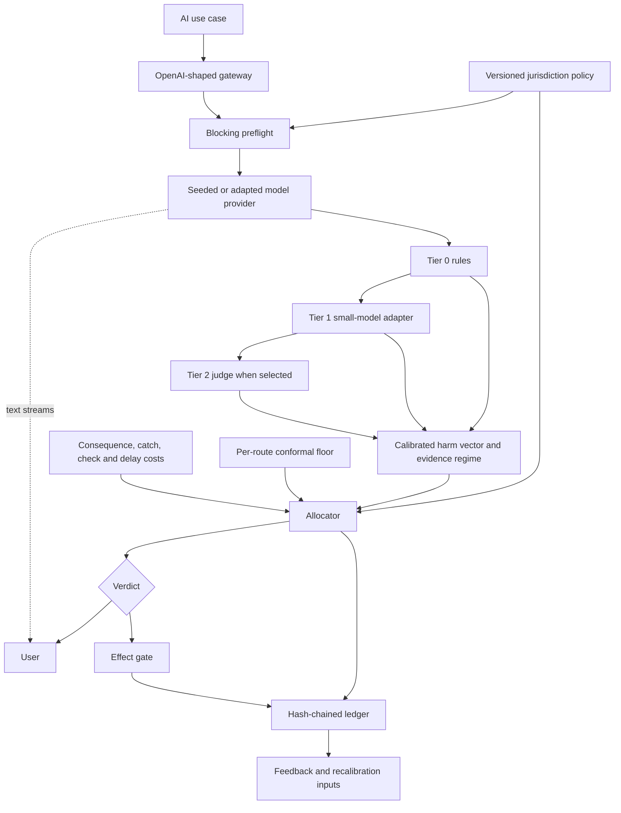

# Architecture and component contracts

The build follows the Round 1 architecture without adding an external service. All decisions use
only request, response, context, samples, and proposed tool calls. No path requires model weights,
hidden states, or log probabilities.

## Runtime sequence

1. The gateway resolves route and jurisdiction, loads the policy from YAML, and runs Tier 0 over the
   prompt. A high-confidence injection phrase stops the request before generation.
2. The provider produces text. For a streaming request, token events are emitted while assessment
   runs in a worker thread.
3. Tier 0 checks patterns and context numbers. Tier 1 supplies replaceable grounding, safety, and
   anomaly signals. The seeded build uses lexical adapters so it remains offline.
4. Route-specific isotonic maps transform each harm axis. The evidence regime is grounded,
   ungrounded-but-estimable, or unverifiable.
5. A per-route exact-binomial Learn-Then-Test threshold identifies mandatory checks. The economic
   rule prices each tier with the current shadow price. If Tier 2 is selected, its signal is added and
   the allocation is recomputed.
6. Text receives allow, annotate, abstain, hold, or block. Financial, irreversible, and configured
   external effects are held or denied independently of text delivery.
7. The ledger appends the full decision terms with a previous-record hash, policy version, and policy
   content hash.

## Code contracts

| Component | Input | Output | Prototype file |
| --- | --- | --- | --- |
| Gateway | OpenAI-shaped request and route header | JSON or SSE text plus decision | `controlplane/gateway/app.py` |
| Policy | Route and jurisdiction | Validated route policy, version, content hash | `controlplane/policy/loader.py` |
| Tier 0 | Prompt, response, context | Pattern, numeric, PII, and injection scores | `controlplane/detectors/tier0_rules.py` |
| Tier 1 | Response, evidence, samples | Grounding, bias, safety, anomaly scores | `controlplane/detectors/tier1_models.py` |
| Tier 2 | Response and context | Escalated judge scores | `controlplane/detectors/tier2_judge.py` |
| Risk | Detector signals | Five-axis calibrated vector and evidence regime | `controlplane/risk/` |
| Cost | Policy and effect class | Per-tier `c`, `k`, `v`, and `d` terms | `controlplane/economics/cost_model.py` |
| Guarantee | Calibration score/label pairs | Route release threshold and upper bound | `controlplane/guarantees/conformal.py` |
| Allocator | Risk, costs, lambda, floor | Tier, verdict, and arithmetic trace | `controlplane/economics/allocator.py` |
| Effect gate | Tool calls, verdict, policy | Permit, hold, or deny per effect | `controlplane/effects/effect_gate.py` |
| Ledger | Decision trace | SQLite row linked by hashes | `controlplane/ledger/store.py` |

## State and failure boundaries

Policy files are checked for modification on resolution and reloaded in-process. Calibration maps and
the budget controller are process-local in this prototype. The SQLite ledger is local and its append
is synchronous. A production multi-worker deployment would need shared calibration versions, a
windowed controller, durable queues, identity, and an external append-only audit sink. Those are
deployment changes, not new decision stages.
